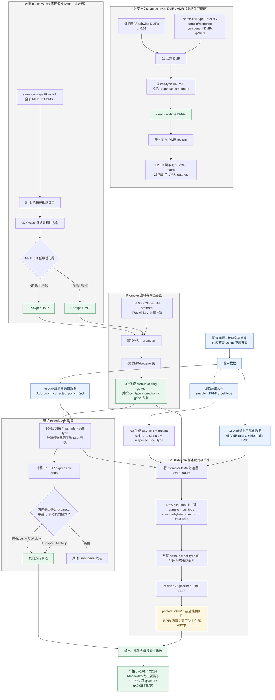

# q<0.01 分析流程示意图

## 如何阅读这张图

- **分支 A（00–03）**：构建 clean cell-type DMR/VMR 特征；先扣除同一细胞类型中 IR 与 NR 的 component，避免将应答状态当作细胞类型差异。
- **分支 B（04–12）**：直接在相同细胞类型内比较 IR 与 NR，保留的正是与免疫治疗应答状态相关的 DMR；这是 promoter、RNA 和相关性整合所使用的主线。
- **关键区分**：clean 分支的“扣除”不能用于分支 B；若在疾病/应答 DMR 上再扣除 IR-vs-NR 信号，会把研究对象本身删掉。
- **相关性限制**：目前每个 response × cell type 只有 5 个样本。`min_paired_samples=6` 时只计算合并 IR+NR 的 pooled 相关性；它用于描述性优先级排序，不能作为组内关联或因果结论。
